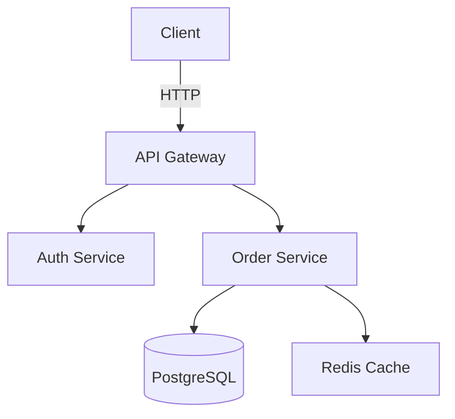

# Documentation Tools Reference

## Docusaurus (React-based)

**Use when:** Building a full documentation site with versioning, search, blog.

```
npx create-docusaurus@latest docs classic
```

- **Versioned docs**: `docs/current/`, `docs/1.x/`, `docs/2.x/` — side-by-side versioned content
- **MDX support**: Embed React components inside Markdown (tabs, code blocks, callouts)
- **Search**: Algolia DocSearch (configured via `docusaurus.config.js`)
- **Plugins**: `@docusaurus/plugin-content-docs`, `plugin-content-blog`, `plugin-ideal-image`
- **Frontmatter**: `sidebar_position`, `description`, `tags`, `draft`, `pagination_next/prev`

## MkDocs (Python-based)

**Use when:** Simple, fast, Markdown-only documentation (no React).

```
mkdocs new docs
mkdocs serve
```

- **Material theme**: `mkdocs-material` — search, navigation, color schemes, code copy button
- **Plugins**: `mkdocs-awesome-pages`, `mkdocs-minify-plugin`, `mkdocs-redirects`
- **Configuration**: `mkdocs.yml` with `nav`, `theme`, `plugins`, `markdown_extensions`
- **Admonitions**: `!!! note`, `!!! warning`, `!!! tip` for callout boxes

```
!!! warning "API Rate Limits"
    The free tier is limited to 100 requests/hour.

    Upgrade to Premium for unlimited access.
```

- **Code annotations**: `[^1]` inline annotations in code blocks for explanations

## Storybook (Component Documentation)

**Use when:** Documenting UI component libraries with live/interactive examples.

```
npx storybook@latest init
```

- **Stories**: One `.stories.tsx` per component, with args to control props
- **Controls**: Auto-generated UI controls for each prop (text, boolean, select)
- **Docs addon**: `@storybook/addon-docs` generates markdown docs from stories
- **Meta block**: `title`, `component`, `argTypes`, `parameters` for categorization
- **Tags**: `autodocs` tag enables auto-generated documentation page per component

## JSDoc / TSDoc (Inline Code Documentation)

**Tooling:** TypeDoc (TS), JSDoc (JS), generate HTML/markdown from comments.

```
npx typedoc src/index.ts --out docs
```

```
/**
 * Creates a throttled function that only calls `fn` once every `wait` ms.
 *
 * @param fn - The function to throttle
 * @param wait - Throttle interval in milliseconds
 * @param options - { leading: boolean, trailing: boolean }
 * @returns A throttled function with `.cancel()` method
 *
 * @example
 * const save = throttle(api.save, 1000);
 * save(); // calls immediately
 * save(); // ignored (within 1s)
 */
```

- Document all public APIs (exported functions, classes, interfaces)
- Use `@param`, `@returns`, `@throws`, `@example` consistently
- Mark internal APIs with `@internal` to exclude from generated docs

## OpenAPI / Swagger (API Documentation)

**Spec-first** approach with OpenAPI 3.x:

```yaml
paths:
  /orders:
    post:
      summary: Create a new order
      requestBody:
        content:
          application/json:
            schema:
              $ref: '#/components/schemas/CreateOrder'
      responses:
        '201':
          description: Order created successfully
          headers:
            X-Request-Id:
              schema: { type: string }
```

- **Swagger UI**: Interactive API explorer (try-it-out feature)
- **Redoc**: Beautiful read-only API reference (better for production docs)
- **Editor**: `swagger-editor` for visual spec editing with validation
- **Code generation**: `openapi-generator` for client SDKs (JS, Python, Go, Java)

## Vitepress (Vite-powered)

**Use when:** Vite-based project, need fast, simple documentation site.

```
npx vitepress@latest init docs
```

- **Default theme**: Search, sidebar, nav bar, edit links out of the box
- **Frontmatter**: `title`, `description`, `sidebar`, `outline`, `lastUpdated`
- **Markdown extensions**: Code groups, containers (tip, warning, danger), line highlighting in code blocks
- **Vite integration**: Use Vite plugins (aliases, env vars) inside docs

## AsciiDoc vs Markdown

| Feature | Markdown | AsciiDoc |
|---------|----------|----------|
| Learning curve | Low | Medium |
| Admonitions | Limited (extensions) | Native (`NOTE:`, `WARNING:`) |
| Tables | Basic (piped) | Advanced (colspan, rowspan, formatting) |
| Cross-refs | Anchor-based | `<<id, text>>` system |
| Includes | Limited | `include::file.adoc[]` |
| Best for | Most projects | Large docs, books, standards |

## Doc Generation from Code

| Language | Tool | Input | Output |
|----------|------|-------|--------|
| TypeScript | TypeDoc | `/** */` comments | HTML/Markdown site |
| JavaScript | JSDoc | `/** */` comments | HTML/Markdown |
| Python | Sphinx | docstrings (reST/NumPy/Google) | HTML/PDF/LaTeX |
| Python | pydoc | docstrings | CLI/HTML |
| Go | godoc | comments | HTML |
| Rust | rustdoc | `///` `//!` comments | HTML with search |
| Java | Javadoc | `/** */` comments | HTML |

## Diagramming (Mermaid.js)



- **Sequence diagrams**: `sequenceDiagram` participant → messages → loops/alt
- **Flowcharts**: `graph TD/LR` with nodes, edges, subgraphs
- **Entity-Relationship**: `erDiagram` with entities and relationships
- **C4 diagrams**: `C4Context`, `C4Container` for architecture
- **Mermaid live editor**: [mermaid.live](https://mermaid.live) for prototyping
- **Alternative — PlantUML**: More powerful but requires Java runtime; better for complex C4 and state diagrams
